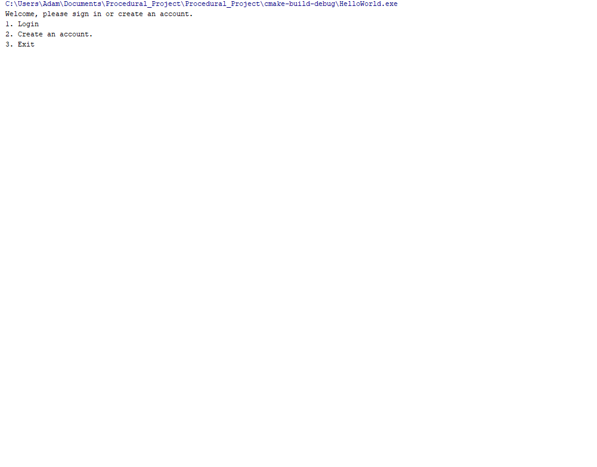

# Project Title
- This project for Programming methodology is an inventory tracking system for a manufacturing company. The intended user is an employee that is able to track the items they produced, as well as add products that the company can produce. Products and items are also added to text files. New Employees can be created and stored in another text file.

- This project was made independently for COP 2001 - Programming Methodology.
- This was made before my junior year, still getting acquainted with basic software development and terminology. This was also my first time programming in C++.
- This was an assignment, but extra features were added to get more familiar with the C++ programming language.
This was made while I was a student at FGCU.

## Demonstration

## Documentation

## Getting Started

## Built With
CLion by JetBrains with Visual Studio Compiler
C++
## Contributing
- Find ways to simplify code and make program more efficient.
- Implement more features for the inventory tracking system.
- Convert from procedural paradigm to an object-oriented version.

## Author
Adam Dressel

## License

## Acknowledgments
https://geeksforgeeks.com/
https://cplusplusreference.com/
https://www.screentogif.com/
## History

## Key Programming Concepts Utilized
If/else constructs, switch cases.
do/while for loops
C++ Stream objects and operators.
C++ function calls
  -Parameters Return values

